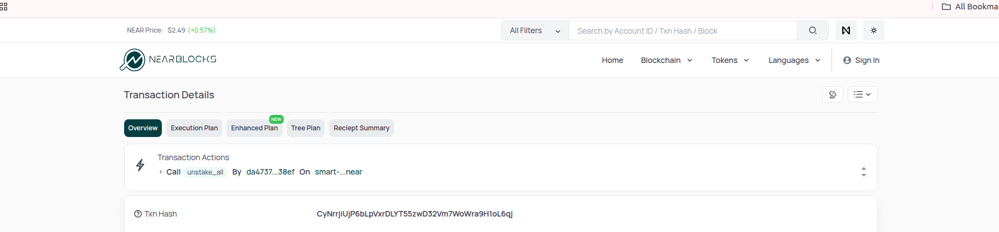
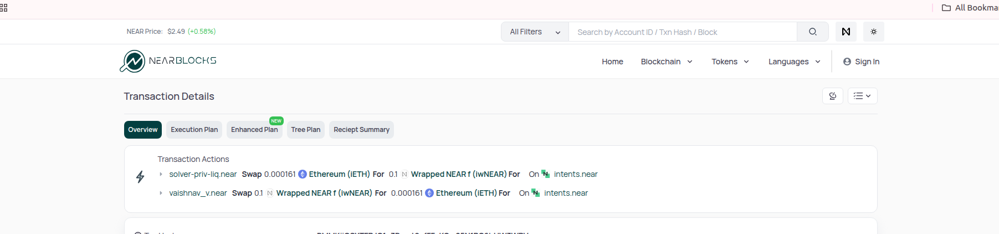
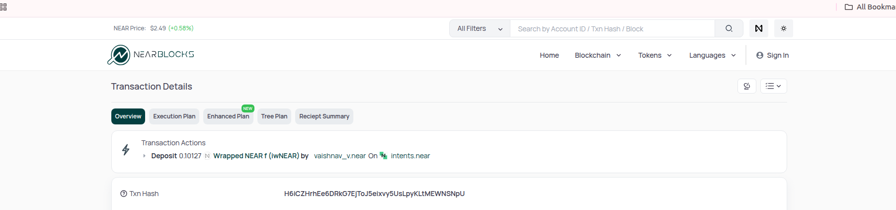
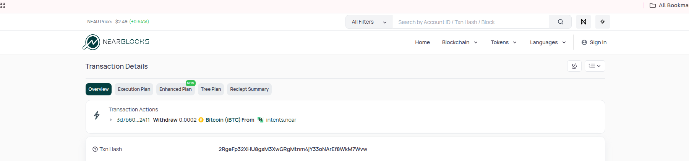

## NEAR Transaction Action Parser API

**NEAR Transaction Action Parser API** is a standalone **Express-based microservice** that processes NEAR blockchain transactions and returns structured JSON representations of known actions.

It supports:

- Intents Standard Actions
- Token actions (NEP-245)

It supports common actions like **transfers**, **staking**, **function calls**, and **token actions**, by converting them into a standardized format for FE. This centralizes transaction parsing logic, making it easy to manage and extend.

For any unknown or custom actions not recognized by the static logic, the service uses the **NEAR AI Agent** as a fallback. The AI agent analyzes the transaction data and returns meaningful, structured output based on custom prompts. This hybrid approach ensures comprehensive coverage of all on-chain activity, even for emerging or contract-specific behaviors.

---

## Features

- Parses standard NEAR actions (transfer, staking, function call, etc.)
- Decodes event logs
- Resolves token metadata (name, symbol, decimals)
- Fallback parsing via NEAR AI Agent for unknown actions
- Swagger (OpenAPI) documentation
- Designed for NEAR explorers, dashboards, and developer tools

---

## Environment Variables

### Backend (deployment environment)

<pre> 
NETWORK=
API_ACCESS_KEY=
</pre>

### Frontend (deployment environment)

<pre>
NEXT_PUBLIC_TXN_ACTION_API_URL= transaction-actions endpoint
</pre>

## API Endpoint

### `POST /v1/txnsaction/:hash`

Parses and returns structured NEAR transaction actions based on provided **raw transaction** data.

- `:hash` – Transaction hash (as route param)
- Request Body – (raw transaction JSON) https://api.nearblocks.io/v1/txns/value,example-txn-hash/full

---

## Sample Input Structure (Body)

```json
{
  "txn": {
    "transaction": {
      "transaction_hash": "string",
      "signer_account_id": "string",
      "receiver_account_id": "string",
      "block": {
        "block_hash": "string",
        "block_height": "number",
        "block_timestamp": "string"
      },
      "actions": [
        {
          "action": "string",
          "args": {
            "method_name": "string",
            "args_json": {
              "signed": [
                {
                  "payload": {
                    "message": "string"
                  },
                  "recipient": "string",
                  "nonce": "string",
                  "signature": "string",
                  "public_key": "string",
                  "standard": "string"
                }
              ]
            },
            "deposit": "string",
            "gas": "string"
          }
        }
      ],
      "outcomes": {
        "status_key": "string",
        "result": {
          "ActionError": {
            "index": "string",
            "kind": {
              "FunctionCallError": {
                "ExecutionError": "string"
              }
            }
          }
        },
        "logs": "array|null"
      },
      "receipts": [
        {
          "receipt_id": "string",
          "outcome": {
            "executor_account_id": "string",
            "gas_burnt": "string",
            "tokens_burnt": "string",
            "logs": [],
            "status": {}
          },
          "block": {
            "block_hash": "string",
            "block_height": "number",
            "block_timestamp": "string"
          }
        }
      ],
      "outcomes_agg": {
        "gas_used": "string",
        "transaction_fee": "string"
      },
      "actions_agg": {
        "deposit": "string",
        "gas_attached": "string"
      },
      "shard_id": "string"
    }
  }
}
```

## sample response

```json
{
  "Actions": [
    {
      "type": "string",
      "methodName": "string",
      "from": {
        "address": "string",
        "short": "string"
      },
      "to": {
        "address": "string",
        "short": "string"
      },
      "receiptId": "string",
      "label": "string",
      "details": {
        "from": {
          "address": "string",
          "short": "string"
        },
        "to": {
          "address": "string",
          "short": "string"
        }
      }
    }
  ]
}
```

## Frontend Rendering: Action Mapping Strategy

- The FE rendering activity using two main components:

  - ActionEvents – for standard NEAR actions (e.g., TRANSFER, ADD_KEY, FUNCTION_CALL)

  - ContractEvents - Token based actions (e.g. deposit, withdraw, swap)

Depending on the type of action returned from the API, the frontend decides which component to use and how to format the information.

### Standard Actions (via ActionEvents)

- These include basic NEAR protocol operations like TRANSFER, ADD_KEY, or FUNCTION_CALL. Based on the type and details fields from the API, we show key details such as:

  - Action type or label (e.g., "Call", "Withdraw")

  - Method name (e.g., withdraw_all, unstake)

  - Attached values by Sender (By) and receiver (On) accounts

### Token based Actions (via ContractEvents)

- For token-related or contract-specific events (e.g., from intents.near, ref-finance.near, burrow.near), the frontend displays:

  - Token info with amount and icon

  - related account details

  - Sender and contract addresses

## API Response → Frontend Rendering Examples

### Standard Actions (via ActionEvents)

- Transfer
  
- Stake action
  
  

### Token based Actions (via ContractEvents)

- Swap
  
- Deposit
  
- Withdraw
  

## Add New Action Types

This supports parsing two types of action representations:

- Standard NEAR actions (e.g., TRANSFER, FUNCTION_CALL) via the Actions section.
- Contract-specific event logs (e.g., from token contracts) via the EventLogs section.

### Flow Overview

When a transaction is parsed, it goes through two main checks to decide how it should be handled:

- If logDetails is available and it's not from a NEP-245 contract, the system assumes it's a regular action (not token-based) and forwards the data to the ActionParser.

- If logDetails is empty and the action is from a NEP-245-compatible contract, it is handled through the parseEventLogs parser, which is specialized for token based actions.

### How to Add a New Action (Standard Actions)

To add a new parser for a known NEAR action (e.g., a method call or on-chain behavior), follow this logic:

- Your action must fall under a known category, such as action.kind, method_name, or contain identifiable data in args.
  If your case isn’t covered by the existing ones, you can register a new match in the ActionParser. This module routes incoming actions to specific parser functions.

Your parser should return a response in the following format:

<pre>
{
type: string;
details: Record<string, any>;
from?: string;
to?: string;
receiptId?: string;
txnHash?: string;
roles?: {
senderLabel?: string;
receiverLabel?: string;
};
}
</pre>

- roles is used for customizing sender/receiver labels in the UI.
  Examples: from → to, by → on, sent to → received by.

### Add a New Contract Event Parser (Token based actions)

- For contracts that emit event logs (e.g., token actions, DeFi interactions):
  If the contract is NEP-245 compatible and has no logDetails, the parser will use parseEventLogs.
  Add your contract-specific parsing logic under the parseEventLogs section based on contract name.

Your parser should return the following structure:

<pre>
{
type: string;
amount?: string;
amountIn?: string;
amountOut?: string;
tokenIn?: string;
tokenOut?: string;
platform?: string;
recipient?: string;
sender?: string;
contract: string;
receiptId: string;

token?: {
symbol: string;
name: string;
decimals: number;
icon?: string;
} | null;

tokenInMeta?: TokenMetadata | null;
tokenOutMeta?: TokenMetadata | null;

token_id?: string;
account_id?: string;

tokenMetadata?: TokenMetadataMap;

[key: string]: any;

}
</pre>

- This structure supports rich token info and metadata needed for the frontend.

## Contributing

We welcome contributions to improve the NEAR Transaction Action Parser, including:

- Adding support for new transaction action types (contract-specific or NEAR standard)
- Improving token metadata resolution
- Enhancing the output structure for better FE rendering

## License

Licensed under the Business Source License 1.1 (BUSL-1.1).
