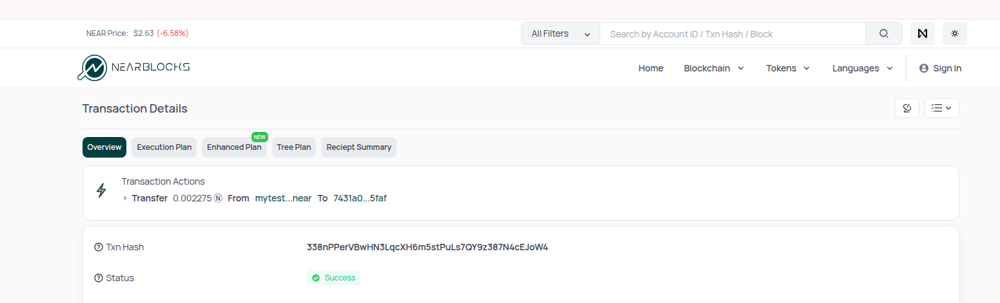
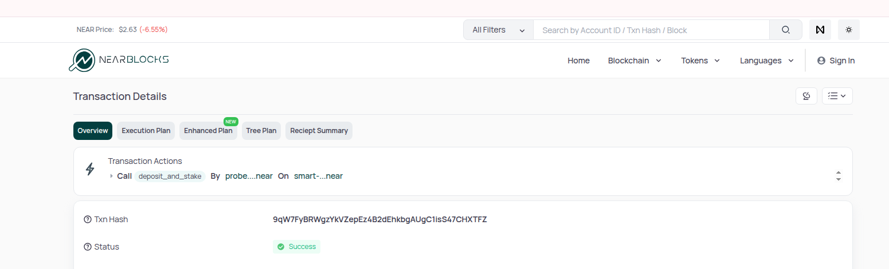
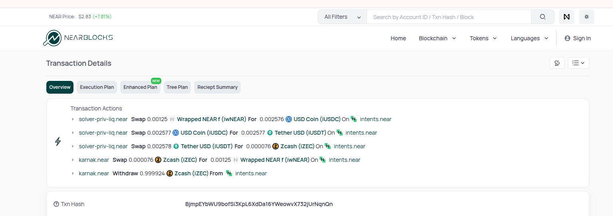
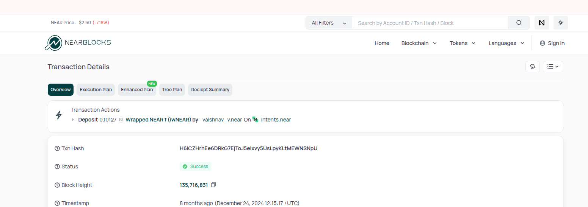
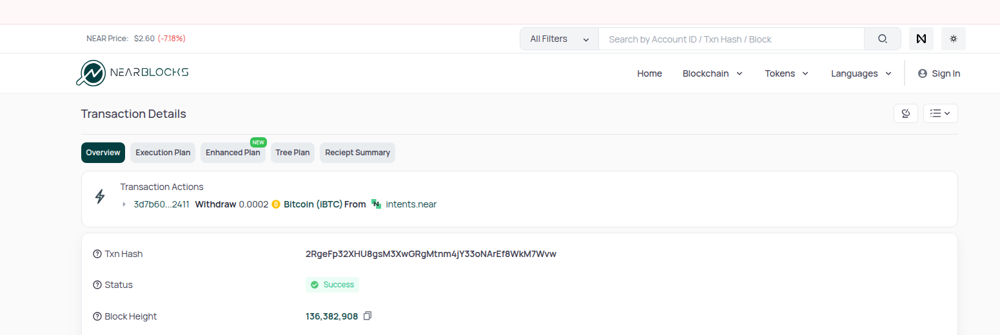

## NEAR Transaction Action Parser API

**NEAR Transaction Action Parser API** is a standalone **Express-based microservice** that processes NEAR blockchain transactions and returns structured JSON representations of known actions.

It supports common actions like **transfers**, **staking**, **function calls**, and **token actions**, by converting them into a standardized format for frontend. This centralizes transaction parsing logic, making it easy to manage and extend.

For any unknown or custom actions not recognized by the static logic, the service uses the **NEAR AI Agent** as a fallback. The AI agent analyzes the transaction data and returns meaningful and structured output based on custom prompts. This hybrid approach ensures comprehensive coverage of all on-chain activity, even for emerging or contract-specific behaviors.

---

## Features

- Parses standard NEAR actions (transfer, staking, function call, etc.)
- Decodes event logs
- Resolves token metadata (name, symbol, decimals)
- Fallback parsing via NEAR AI Agent for unknown actions
- Swagger (OpenAPI) documentation
- Designed for NEAR explorers, dashboards, and developer tools

---

## Environment Variables

### Backend (deployment environment)

<pre> 
NETWORK={NETWORK}
API_ACCESS_KEY={API_ACCESS_KEY}
</pre>

### Frontend (deployment environment)

<pre>
NEXT_PUBLIC_TXN_ACTION_API_URL={NEXT_PUBLIC_TXN_ACTION_API_URL}
</pre>

## API Endpoint

### `POST /v1/txnsaction/:hash`

Parses and returns structured NEAR transaction actions based on provided **raw transaction** data.

- `:hash` – Transaction hash (as route param)
- Request Body – (raw transaction JSON) https://api.nearblocks.io/v1/txns/value,example-txn-hash/full

---

## Sample Input Structure (Body)

```json
{
  "txn": {
    "transaction": {
      "transaction_hash": "string",
      "signer_account_id": "string",
      "receiver_account_id": "string",
      "block": {
        "block_hash": "string",
        "block_height": "number",
        "block_timestamp": "string"
      },
      "actions": [
        {
          "action": "string",
          "args": {
            "method_name": "string",
            "args_json": {
              "signed": [
                {
                  "payload": {
                    "message": "string"
                  },
                  "recipient": "string",
                  "nonce": "string",
                  "signature": "string",
                  "public_key": "string",
                  "standard": "string"
                }
              ]
            },
            "deposit": "string",
            "gas": "string"
          }
        }
      ],
      "outcomes": {
        "status_key": "string",
        "result": {
          "ActionError": {
            "index": "string",
            "kind": {
              "FunctionCallError": {
                "ExecutionError": "string"
              }
            }
          }
        },
        "logs": "array|null"
      },
      "receipts": [
        {
          "receipt_id": "string",
          "outcome": {
            "executor_account_id": "string",
            "gas_burnt": "string",
            "tokens_burnt": "string",
            "logs": [],
            "status": {}
          },
          "block": {
            "block_hash": "string",
            "block_height": "number",
            "block_timestamp": "string"
          }
        }
      ],
      "outcomes_agg": {
        "gas_used": "string",
        "transaction_fee": "string"
      },
      "actions_agg": {
        "deposit": "string",
        "gas_attached": "string"
      },
      "shard_id": "string"
    }
  }
}
```

## sample response

```json
{
  "Actions": [
    {
      "type": "string",
      "methodName": "string",
      "from": {
        "address": "string",
        "short": "string"
      },
      "to": {
        "address": "string",
        "short": "string"
      },
      "receiptId": "string",
      "label": "string",
      "details": {
        "from": {
          "address": "string",
          "short": "string"
        },
        "to": {
          "address": "string",
          "short": "string"
        }
      }
    }
  ]
}
```

## Frontend Rendering: Action Mapping Strategy

- The frontend shows transaction actions in two different ways, depending on the type of action the API returns:

  - ActionEvents – for standard NEAR actions (e.g., TRANSFER, ADD_KEY, FUNCTION_CALL)

  - ContractEvents – token-based actions (e.g., deposit, withdraw, swap)

Depending on the type of action returned from the API, the frontend decides which component to use and how to format the information.

### 1. Standard Actions (shown with ActionEvents)

- These are basic NEAR blockchain operations, such as:

  - Sending NEAR (TRANSFER)

  - Adding an access key (ADD_KEY)

  - Calling a method on a contract (FUNCTION_CALL)

  For these actions, the frontend shows:

  - The action type or label (e.g., “Call”, “Withdraw”)

  - The method name (e.g., withdraw_all, unstake)

  - The sender (“By”) and receiver (“On”) accounts

  Any attached value (NEAR sent with the action)

### Token based Actions (via ContractEvents)

- These come from token-related or contract-specific events (e.g., intents.near, ref-finance.near, burrow.near).

  For these actions, the frontend shows:

  - Token details – name, symbol, amount, and icon

  - The account involved (who sent or received)

  - The sender and contract addresses

## API Response → Frontend Rendering Examples

### Standard Actions (via ActionEvents)

- Transfer
  
- Stake action
  
  

### Token based Actions (via ContractEvents)

- Swap
  
- Deposit
  
- Withdraw
  

## Add New Action

Our system processes NEAR transactions in two main ways:

- Standard NEAR actions – e.g., TRANSFER, FUNCTION_CALL (handled by the Actions section).

- Contract event logs – e.g., token swaps, deposits, staking (handled by the EventLogs section).

### How It Works

When we parse a transaction, the system decides how to process it:

- If logDetails exists and the contract is not NEP-245 (multi-token standard), it’s treated as a regular NEAR action and sent to the ActionParser.

- If logDetails is empty but the contract is NEP-245-compatible, it’s treated as a token-based action and processed by parseEventLogs.

### How to Add a New Action (Standard Actions)

To add a new parser for a known NEAR action (e.g., a method call or on-chain behavior), follow this logic:

    - Make sure it can be identified by:
      action.kind, or method_name, or Data inside args.

    If it’s not already covered, add a new match in ActionParser to route it to your new parser function.

Your parser should return a response in the following format:

<pre>
example :
{
  "type": "action_type",
  "details": {
    "amount": "1000000000000000000000000",
    "token": "usdt.near"
  },
  "from": "alice.near",
  "to": "bob.near",
  "receiptId": "some-receipt-id",
  "txnHash": "some-tx-hash",
  "roles": {
    "senderLabel": "Sender",
    "receiverLabel": "Receiver"
  }
}
</pre>

- The roles field is used for customizing sender/receiver labels in the UI.
  Examples: 'from → to', 'by → on', 'sent to → received by'.

### Add a New Contract Event Parser (Token based actions)

- For contracts that emit event logs (e.g., token actions, DeFi interactions):
  - If the contract is NEP-245-compatible and logDetails is empty, the parser will use parseEventLogs.
  - Match the contract name inside parseEventLogs and call your parser.

Your parser should return the following structure:

<pre>
example:
{
  "type": "action_type",
  "amount": "1000000000000000000000000",
  "amountIn": "1000000000000000000000000",
  "amountOut": "990000000000000000000000",
  "tokenIn": "usdt.near",
  "tokenOut": "usdc.near",
  "platform": "ref-finance.near",
  "recipient": "alice.near",
  "sender": "bob.near",
  "contract": "ref-finance.near",
  "receiptId": "some-receipt-id",
  "token": {
    "symbol": "USDT",
    "name": "Tether USD",
    "decimals": 6,
    "icon": "https://example.com/usdt.png"
  },
  "tokenInMeta": {
    "symbol": "USDT",
    "name": "Tether USD",
    "decimals": 6,
    "icon": "https://example.com/usdt.png"
  },
  "tokenOutMeta": {
    "symbol": "USDC",
    "name": "USD Coin",
    "decimals": 6,
    "icon": "https://example.com/usdc.png"
  },
  "token_id": "usdt.near",
  "account_id": "alice.near",
  "tokenMetadata": {
    "usdt.near": {
      "symbol": "USDT",
      "name": "Tether USD",
      "decimals": 6,
      "icon": "https://example.com/usdt.png"
    },
    "usdc.near": {
      "symbol": "USDC",
      "name": "USD Coin",
      "decimals": 6,
      "icon": "https://example.com/usdc.png"
    }
  },
  "customField": "any additional data"
}
</pre>

- This structure supports rich token information and metadata needed by the frontend.

## Contributing

We welcome contributions to improve the NEAR Transaction Action Parser, including:

- Adding support for new transaction action types (contract-specific or NEAR standard)
- Improving token metadata resolution
- Enhancing the output structure for better frontend rendering

## License

Licensed under the Business Source License 1.1 (BUSL-1.1).
